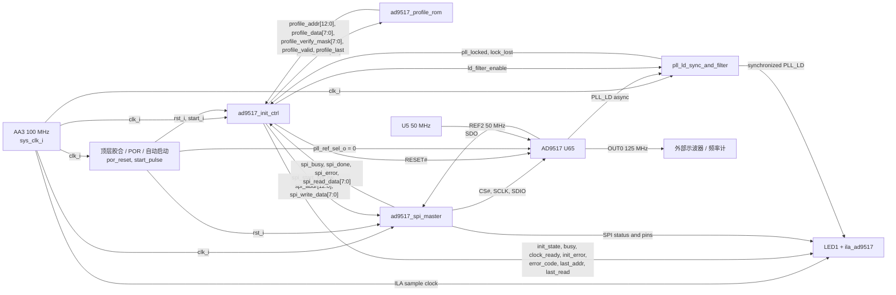
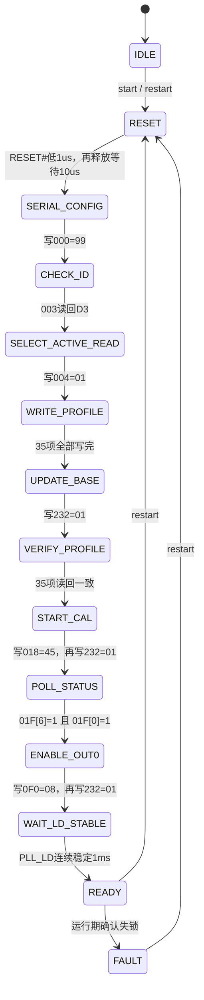

# AD9517 时钟管理模块设计

状态：`RTL_SIM_BUILD_DIGITAL_HW_PASS_FREQ_MEASUREMENT_PENDING`

## 1. 设计目标与边界

### 1.1 目标

FPGA 使用板上已有的 AA3 100 MHz 时钟，通过四线 SPI 配置 U65 `AD9517-4`，使其以 U5 的
50 MHz 为参考，从 OUT0 输出 125 MHz。模块必须完成：

1. AD9517 硬件复位和串口模式配置。
2. 器件 ID 检查。
3. 最终寄存器 profile 写入和 active-register 读回校验。
4. VCO 校准和数字锁定状态轮询。
5. 校准与锁定成功后使能 OUT0。
6. 对异步 `PLL_LD` 进行同步、判稳和运行期失锁过滤。
7. 通过 LED 和 ILA 给出初始化、成功或错误状态。

最终频率关系为：

```text
50 MHz / R=2 × N=60 / VCO_DIV=3 / OUT0_DIV=4 = 125 MHz
```

### 1.2 本模块不做什么

- 不实例化 GT、PCS/PMA、TEMAC、Clocking Wizard 或 UDP 数据面。
- 不用 AD9517 尚未生成的 125 MHz 驱动自身配置逻辑。
- 不用 `PLL_LD=1` 或 `clock_ready=1` 代替外部仪器的频率测量。
- 首版只使能 OUT0；未使用的 AD9517 输出保持关闭。

### 1.3 已确定的器件设计输入

| 项目 | 最终采用值 |
|---|---|
| 器件 | AD9517-4 |
| 参考输入 | REF2，50 MHz |
| R / P / A / B | `R=2`、`P=8`、`A=4`、`B=7`，因此 `N=P×B+A=60` |
| PFD / VCO | 25 MHz / 1500 MHz |
| VCO divider / OUT0 divider | `/3` / `/4` |
| OUT0 | 125 MHz、LVPECL、780 mV、非反相 |
| Charge-pump current | 1.2 mA |
| 板载环路滤波器 | C1=470 pF、R1=750 Ω、C2=6.8 nF、R2=1.5 kΩ、C3=150 pF，器件内部 Ct≈31 pF |
| ADIsimCLK 结果 | Loop bandwidth 60.94 kHz，phase margin 47.4° |

寄存器配置由 AD9516/AD9517/AD9518 Evaluation Software 导出的
[`SGMII_125M_V1.stp`](SGMII_125M_V1.stp) 固定，并与 `ad9517_profile_rom` 保持一致。

## 2. 顶层接口与板级连接

`ad9517_clock_manager` 是 AD9517 独立板级验证外壳，直接连接 AA3 100 MHz、LED1、U65 控制
接口和 ILA。

| 端口 | 方向 | FPGA 管脚 | 含义 |
|---|---|---|---|
| `sys_clk_i` | 输入 | `AA3` | 100 MHz；驱动全部控制逻辑和 ILA |
| `led1` | 输出 | `A18` | READY 常亮、初始化慢闪、错误快闪 |
| `pll_cs_n_o` | 输出 | `G19` | AD9517 四线 SPI `CS#` |
| `pll_sclk_o` | 输出 | `F20` | 5 MHz SPI 串行时钟波形 |
| `pll_sdio_o` | 输出 | `J20` | FPGA 到 AD9517 的 MOSI/SDIO |
| `pll_sdo_i` | 输入 | `K20` | AD9517 到 FPGA 的 MISO/SDO |
| `pll_ref_sel_o` | 输出 | `J18` | 固定为 0；profile 通过寄存器选择 REF2 |
| `pll_ld_i` | 输入 | `J19` | AD9517 异步数字锁定指示 |
| `pll_reset_n_o` | 输出 | `K18` | AD9517 硬件复位，低有效 |

板级时钟输出链只作为外部测量对象：

```text
U5 50 MHz ──> U65 REF2
                 │
                 └── OUT0/OUT0# 125 MHz LVPECL
                           └──> SN65LVDS100 ──> MGT116_CLK0_P/N
```

首选测量点是 U65 OUT0/OUT0#（Pin 42/41）；可选测量点是 SN65LVDS100 的 Y/Z（Pin 7/6）。

## 3. 技术架构

### 3.1 子模块和信号流图

功能 RTL 划分为四个子模块：profile ROM、初始化控制器、SPI master 和锁定同步/过滤器。
顶层另外负责上电启动、LED 状态编码和 ILA 观测。下图中的箭头是实际接口信号，不表示未来
系统模块。



### 3.2 为什么这样划分模块

AD9517 初始化同时包含三类性质不同的工作：35 项配置数据、严格排序的启动流程，以及精确到
引脚边沿的 SPI 时序；`PLL_LD` 又是一个来自芯片的异步信号。如果全部写进一个状态机，修改
profile 时容易碰到 SPI 时序，调整 SPI 时钟时又可能影响初始化流程，仿真也很难判断错误来自
寄存器、事务还是判锁。因此设计按“变化原因”拆成四块，而不是按代码行数拆分。

| 设计选择 | 这样设计的原因 | 得到的结果 |
|---|---|---|
| Profile 单独放入组合 ROM | 频率方案改变时，变化的是地址和数据，不是控制流程；35 项规模也不需要引入 BRAM 读延迟 | profile 可以逐项与 `.stp` 比对，控制器只处理索引和结束标志 |
| 初始化顺序集中在 controller | 复位、IO Update、读回、校准和使能之间存在唯一安全顺序 | 所有阶段、超时和故障出口在一个状态机内可见，不会由多个模块竞争 SPI |
| SPI master 只处理一笔事务 | AD9517 的 24-bit 串行格式和引脚边沿属于传输层，与寄存器语义无关 | SPI 可以独立仿真；profile 或启动顺序改变时不需要重新设计位时序 |
| `PLL_LD` 使用独立同步/过滤器 | `PLL_LD` 相对 100 MHz 异步，直接进入主状态机会带来亚稳态和假锁风险 | controller 只消费已经同步并判稳的 `pll_locked/lock_lost` |
| 板级 POR、LED 和 ILA 留在顶层 | 这些内容服务当前板卡验证，不属于 AD9517 寄存器协议 | 四个功能子模块保持可复用，换系统外壳时不必携带当前 LED/ILA 形式 |

本配置是固定且规模很小的上电序列，因此采用纯 RTL，而没有加入 MicroBlaze、AXI 或软件启动
依赖。SPI SCLK 也没有成为新的 FPGA 内部时钟：master 在 100 MHz 域内使用 clock-enable
产生 5 MHz 引脚波形，从而让 controller、SPI、LD filter 和 ILA 全部留在同一时钟域。

判锁和失锁采用不对称过滤。上电阶段连续高 1 ms 才承认锁定，避免短暂高脉冲提前打开
`clock_ready`；READY 后连续低 8 个周期便报告失锁，使真正的时钟异常能够快速撤销 ready。

### 3.3 子模块职责

| 子模块 | 职责 | 不负责的内容 |
|---|---|---|
| `ad9517_profile_rom` | 保存唯一最终 base profile；按索引输出地址、数据、校验掩码和末项标志 | 不决定写入顺序和 SPI 时序 |
| `ad9517_init_ctrl` | 控制复位、写入、读回、校准、判锁、OUT0 使能、超时和错误锁存 | 不直接产生 SCLK 边沿 |
| `ad9517_spi_master` | 把一笔地址/数据请求转换成 24-bit、MSB-first 四线 SPI 波形 | 不理解寄存器功能和初始化阶段 |
| `pll_ld_sync_and_filter` | 2-FF 同步 `PLL_LD`，连续高判锁，连续低判失锁 | 不读取 AD9517 状态寄存器 |
| 顶层胶合逻辑 | 上电 POR、单次自动启动、固定 `REF_SEL`、LED 和 ILA 连接 | 不增加第二套初始化流程 |

### 3.4 内部接口约定

| 接口 | 请求方 → 响应方 | 约定 |
|---|---|---|
| Profile 查询 | controller ↔ ROM | controller 给出 `profile_index`；ROM 组合输出一项配置。`valid=0` 视为 profile 错误 |
| SPI 请求 | controller → SPI master | `spi_start` 仅拉高一个 100 MHz 周期；同时锁定 `rw/addr/write_data` |
| SPI 完成 | SPI master → controller | controller 只以 `done` 结束事务；`error` 同周期有效；等待超过预算进入故障 |
| 锁定判稳 | controller ↔ LD filter | OUT0 完成 IO Update 后才使能过滤器，确保 1 ms 判稳窗口发生在输出打开之后 |
| 状态观测 | controller/SPI/filter → top | 状态只进入 LED 和 64-bit ILA debug bus，不参与另一套控制路径 |

## 4. 关键状态机设计

### 4.1 初始化主流程

`ad9517_init_ctrl` 是本模块的关键状态机。下图按设计阶段显示主路径；每一笔 SPI 操作在 RTL
中拆成一个 `*_REQ` 状态和一个 `*_WAIT` 状态，避免重复发出请求。



任意 SPI `*_WAIT` 状态遇到 `spi_error` 或事务超时都会进入 `FAULT`；profile 越界、ID 错误、
读回不一致、校准超时和锁定超时也直接进入 `FAULT`。进入故障时撤销 `clock_ready`、关闭
锁定过滤器并重新拉低 AD9517 `RESET#`，不执行无限自动重试。

### 4.2 为什么状态机采用这个顺序

| 状态机设计 | 原因 |
|---|---|
| 复位后先配置串口，再读 Part ID | 四线模式和位序尚未固定前，后续读写没有可信基础；ID 正确同时证明指令格式、SDIO 和 SDO 基本连通 |
| Base profile 中让 OUT0 保持 power-down | PLL 参数尚未提交和校验时不向板级时钟网络输出不确定波形 |
| IO Update 后再读 active registers | AD9517 具有 buffered/active 两套寄存器；只读写入缓冲值无法证明实际工作的寄存器已经正确生效 |
| 读回通过后才启动 VCO 校准 | 校准依赖 R/N、VCO divider 和参考选择；错误参数下启动校准没有验证意义 |
| 轮询 `0x01F`，不使用固定延时 | VCO 校准和 DLD 建立时间会随上电条件变化；轮询既能提前继续，也能区分校准未完成和未锁定 |
| 校准与 DLD 均有效后才使能 OUT0 | 将“不确定输出”限制在芯片内部，板级只看到已经配置并锁定的 125 MHz |
| OUT0 IO Update 完成后重新开始 1 ms LD 窗口 | 避免把校准阶段出现的 `PLL_LD` 高电平误算成输出使能后的稳定时间 |
| 每笔 SPI 拆成 `REQ` / `WAIT` 两个状态 | `REQ` 只发一个周期的 `start`；`WAIT` 独立等待 `done`，不会因状态停留而重复启动同一事务 |
| 不同阶段使用独立错误码和超时 | 上板后可以从 ILA 直接判断故障发生在传输、ID、读回、校准还是判锁阶段 |
| 所有失败汇入 `ST_FAULT` | 故障后统一撤销 ready、关闭过滤器并拉低 RESET#，使器件回到确定的安全状态；不自动循环重试，便于保留第一次失败证据 |
| READY 仍持续监视 `lock_lost` | 初始化成功不是永久结论，运行期失锁必须立即撤销 `clock_ready` |

### 4.3 状态分组与动作

| RTL 状态 | 主要动作 | 正常转移条件 |
|---|---|---|
| `ST_IDLE` | 保持 RESET# 低，等待启动 | `start_i` 或 `restart_i` |
| `ST_RESET_ASSERT` | RESET# 保持低 1 us | 计时完成 |
| `ST_RESET_RELEASE` | RESET# 拉高并等待 10 us | 计时完成 |
| `ST_SERIAL_REQ` / `ST_SERIAL_WAIT` | 写 `0x000=0x99`，切换为 long instruction、MSB-first、四线 SPI | SPI 完成 |
| `ST_ID_REQ` / `ST_ID_WAIT` | 读 `0x003` | 返回 `0xD3` |
| `ST_READCTRL_REQ` / `ST_READCTRL_WAIT` | 写 `0x004=0x01`，后续读取 active registers | SPI 完成 |
| `ST_BASE_REQ` / `ST_BASE_WAIT` | 从 ROM 逐项写入 35 项 base profile | `last=1` |
| `ST_UPDATE_BASE_REQ` / `ST_UPDATE_BASE_WAIT` | 写 `0x232=0x01`，提交 base profile | SPI 完成 |
| `ST_VERIFY_REQ` / `ST_VERIFY_WAIT` | 逐项读回，以 `((read^expected)&mask)==0` 比较 | 35 项全部一致 |
| `ST_CAL_REQ` / `ST_CAL_WAIT` | 写 `0x018=0x45`，产生 VCO cal 0→1 | SPI 完成 |
| `ST_UPDATE_CAL_REQ` / `ST_UPDATE_CAL_WAIT` | 写 `0x232=0x01`，启动校准 | SPI 完成 |
| `ST_STATUS_REQ` / `ST_STATUS_WAIT` | 循环读 `0x01F` | Bit 6 和 Bit 0 同时为 1 |
| `ST_OUT0_REQ` / `ST_OUT0_WAIT` | 写 `0x0F0=0x08`，准备打开 OUT0 | SPI 完成 |
| `ST_UPDATE_OUT_REQ` / `ST_UPDATE_OUT_WAIT` | 写 `0x232=0x01`，使 OUT0 设置生效 | SPI 完成后启动 LD 过滤器 |
| `ST_WAIT_LD` | 等待同步后的 `PLL_LD` 连续为高 | 稳定 1 ms |
| `ST_READY` | `clock_ready=1`，持续监视失锁 | `lock_lost` 或 restart |
| `ST_FAULT` | 锁存错误、`clock_ready=0`、RESET# 拉低 | 只接受 restart |

### 4.4 错误编码

| 编码 | 含义 | 触发条件 |
|---:|---|---|
| `0x0` | 无错误 | 正常初始化或 restart 后清零 |
| `0x1` | SPI timeout | controller 等待 `done` 超时 |
| `0x2` | SPI engine error | SPI master 拒绝参数或报告协议错误 |
| `0x3` | Part ID error | `0x003 != 0xD3` |
| `0x4` | Verify error | active register 与 ROM/掩码比较失败 |
| `0x5` | Calibration timeout | `0x01F[6]` 未在 10 ms 内置位 |
| `0x6` | Lock timeout | DLD 或外部 `PLL_LD` 未在预算内成立 |
| `0x7` | Runtime lock loss | READY 后确认连续失锁 |
| `0x8` | Profile error | ROM 索引无效或状态异常 |

## 5. SPI 事务设计

一笔事务固定发送 24 bit：

```text
{R/W, W1:W0=2'b00, address[12:0], data[7:0]}
```

- `rw=0` 写，`rw=1` 读；指令和数据均 MSB-first。
- `CS#` 空闲为高，SCLK 空闲为低；默认 SCLK 为 5 MHz。
- 写数据只在 SCLK 下降沿后改变，在下一上升沿由 AD9517 采样。
- 读事务的数据阶段在 SCLK 上升沿采样 `pll_sdo_i`。
- 5 MHz SCLK 只是 100 MHz 域内寄存器产生的输出波形，不建立新的 FPGA 时钟域。
- `start_i` 在 busy 时再次到来属于调用错误，但不得破坏已经进行的事务。

## 6. 最终寄存器方案

当前采用的唯一配置来源为 `SGMII_125M_V1.stp`，ROM 中的 35 项 base profile 为：

```text
010=1C  011=02  012=00  013=04  014=07  015=00  016=04
017=00  018=44  019=00  01A=00  01B=00  01C=44  01D=00
0F0=0A  0F1=0A  0F4=0A  0F5=0A
140=43  141=43  142=43  143=43
190=11  191=00  192=00  196=00  197=80  198=00
19C=30  19D=00  1A1=30  1A2=00
1E0=01  1E1=02  230=00
```

其中 `0x0F0=0x0A` 让 OUT0 在配置和校验阶段保持 safe power-down。控制器按以下固定顺序
执行 ROM 以外的特殊操作：

| 顺序 | 操作 | 作用 |
|---:|---|---|
| 1 | 写 `0x000=0x99` | 固定四线、MSB-first、long instruction 串口模式 |
| 2 | 读 `0x003`，期望 `0xD3` | 确认通信和器件型号 |
| 3 | 写 `0x004=0x01` | 使读操作访问 active registers |
| 4 | 写 35 项 base profile | 配置 PLL/VCO/分频器，OUT0 保持关闭 |
| 5 | 写 `0x232=0x01` | 第一次 IO Update |
| 6 | 读回 35 项，掩码均为 `0xFF` | 校验 active registers |
| 7 | 写 `0x018=0x45`，再写 `0x232=0x01` | 启动 VCO 校准 |
| 8 | 循环读 `0x01F` | 等待 cal-finished 和 DLD |
| 9 | 写 `0x0F0=0x08`，再写 `0x232=0x01` | 打开 OUT0 125 MHz |
| 10 | 观察 `PLL_LD` | 连续稳定后进入 READY |

## 7. 时钟、复位和 CDC

| 项目 | 设计 |
|---|---|
| 主时钟域 | 所有 RTL 只使用 `sys_clk_i=100 MHz` |
| 顶层 POR | FPGA 配置后等待 1024 周期，再产生一次 `start_pulse` |
| AD9517 复位 | RESET# 低 100 周期（1 us），释放后等待 1000 周期（10 us） |
| SPI timeout | 2000 周期（20 us） |
| 校准 timeout | 1,000,000 周期（10 ms） |
| LD 等待 timeout | 2,000,000 周期（20 ms） |
| 判锁窗口 | `PLL_LD` 连续高 100,000 周期（1 ms） |
| 失锁过滤 | READY 后连续低 8 周期（80 ns） |
| `PLL_LD` CDC | `ASYNC_REG` 2-FF 同步后才进入判稳逻辑 |
| `SDO` 采样 | 由本模块产生的 SCLK 确定采样相位，按 SPI 协议采样，不用普通 2-FF 代替 |

`clock_ready` 只表示数字侧已经完成配置、读回、校准、DLD、OUT0 使能和外部 LD 判稳；它不
证明模拟输出频率一定是 125 MHz。

## 8. 可观测性设计

- `led1=1`：READY。
- 初始化期间：慢闪。
- 故障锁存后：快闪。
- 64-bit `debug_bus` 接入 `ila_ad9517`，包含状态、profile 索引、错误码、最后地址/读值、
  controller/SPI/LD 状态和实际引脚电平。
- 当前板级顶层自动启动一次，没有外部 restart 端口；重新尝试需要重新配置 FPGA。控制器
  内部保留 `restart_i`，供以后被系统顶层例化时使用。

## 9. 验证设计与当前结果

### 9.1 行为仿真覆盖

`ad9517_model` 模拟 buffer/active 寄存器、IO Update、Part ID、VCO 校准、`0x01F` 和
`PLL_LD`。自检 testbench 覆盖：

1. 正常初始化和最终 125 MHz 输出设置。
2. Part ID 错误。
3. active-register 读回错误。
4. VCO 校准超时。
5. DLD/锁定超时。
6. READY 后运行期失锁。

六个场景均已通过，正常场景完成 81 笔 SPI 事务和 3 次 IO Update。

### 9.2 构建与板级验收

| 检查项 | 当前结果 |
|---|---|
| Blocking DRC | 0 |
| Setup WNS | +4.329 ns |
| Hold WHS | +0.058 ns |
| 板上 SPI/读回/校准/判锁 | 已通过；ILA 为 READY、无错误、`PLL_LD=1` |
| U65 OUT0 外部频率 | 待用高阻差分探头或频率计确认 125 MHz |
| 重复冷启动成功率 | 待记录 |

模块只有在最终寄存器读回一致、VCO 校准完成、`PLL_LD` 稳定、OUT0 实测 125 MHz，并且重复
启动没有失败后，才能把状态改为 `HARDWARE_VALIDATED_125MHZ`。

## 10. 实现入口

- [`ad9517_clock_manager.v`](../../../fpga/led/led.srcs/sources_1/new/ad9517_clock_manager.v)
- [`ad9517_init_ctrl.v`](../../../fpga/led/led.srcs/sources_1/new/ad9517/ad9517_init_ctrl.v)
- [`ad9517_profile_rom.v`](../../../fpga/led/led.srcs/sources_1/new/ad9517/ad9517_profile_rom.v)
- [`ad9517_spi_master.v`](../../../fpga/led/led.srcs/sources_1/new/ad9517/ad9517_spi_master.v)
- [`pll_ld_sync_and_filter.v`](../../../fpga/led/led.srcs/sources_1/new/ad9517/pll_ld_sync_and_filter.v)
- [`ad9517_clock_manager_tb.v`](../../../fpga/led/led.srcs/sim_1/new/ad9517_clock_manager_tb.v)
- [`ad9517_model.v`](../../../fpga/led/led.srcs/sim_1/new/ad9517_model.v)
- [`ad9517_clock_manager.xdc`](../../../fpga/led/led.srcs/constrs_1/new/ad9517_clock_manager.xdc)
- [`SGMII_125M_V1.stp`](SGMII_125M_V1.stp)
